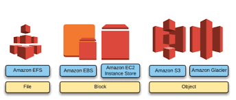
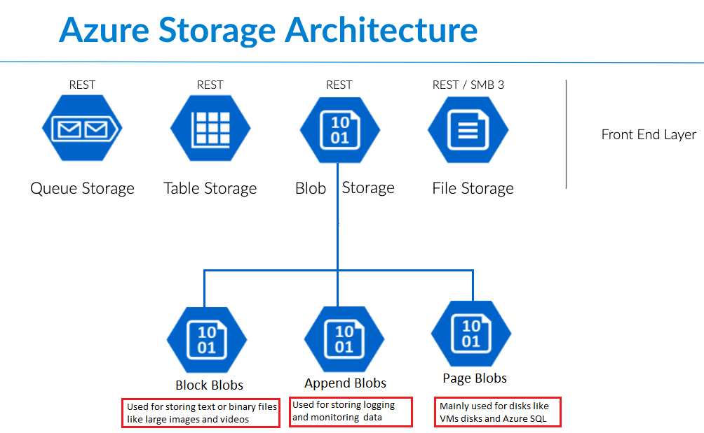
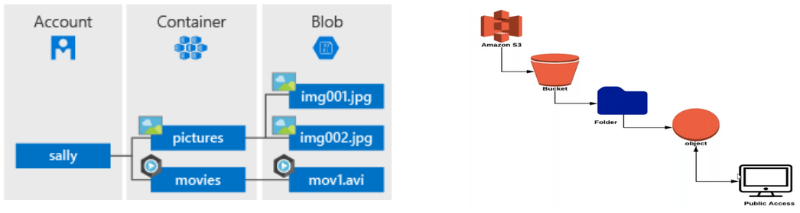
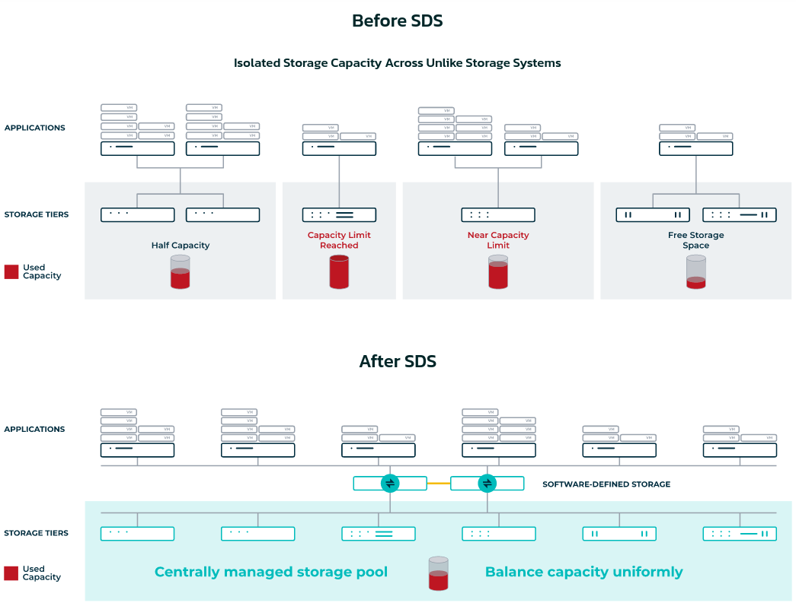

# Cloud Storage and Object Storage

## Compute versus storage

Hardware, for example in a desktop workstation, is composed of resources:

- CPU
- Memory
- Disk
- GPU

CPU, memory and GPU provide the compute, disks provide the storage.

A cluster works similarly across multiple nodes. It distributes the resources across multiple nodes.

In a single node, the operating system boots from a file system. It is then in charge of allocating resources to
processes. In Linux, it is the responsibility of the kernel. When a script is executed or when an application is
launched, the kernel validates the process has access to those resources and allocates enough resources to it.

Distributed systems work similarly. There is a distributed storage and a distributed compute.

In the Hadoop ecosystem: the distributed storage is HDFS; the distributed kernel is YARN; the original distributed
processing engine is MapReduce; additional distributed processing engines include Spark and Flink.

In the Cloud native ecosystem: the distributed storage is flexible, Ceph is a popular solution; the distributed kernel
is Kubernetes; multiple distributed engines exist including Spark and Flink.

## Co-located versus disaggregated architecture

The Hadoop architecture commonly co-locates the storage with the compute. Processing is sent to the nodes hosting the
data (data locality). It is optimized for high throughput because data does not travel through the network between the
disks and the CPUs. Adding storage capacity also means adding compute capacity, and the opposite.

The cloud-native architectures disaggregate compute and storage: the nodes responsible for the storage are separated
from the nodes responsible for the compute. Each can be scaled independently, and compute can be released when idle. The
network becomes the bottleneck, which is mitigated by:

- fast networks between compute and storage nodes
- columnar file formats (Parquet, ORC) which read only the required columns
- predicate pushdown and partition pruning in query engines, which skip irrelevant files
- caching on the compute nodes

## Cloud storage formats

Storage types, which define how bytes are stored and accessed, include block, file system, and object storage. The
infrastructure layer acts as a backbone of the cloud architecture and allows the data architect and data engineer to
implement application and computing layers on top of this storage layer.

- **Block storage**: raw volumes attached to a single machine, formatted with a file system by the operating system. Low
  latency, used by databases and message brokers.
- **File storage**: a shared file system with directories, accessed through NFS or CephFS by multiple machines at the
  same time.
- **Object storage**: objects stored in flat buckets and accessed through an HTTP API (S3). Massively scalable and
  cheap, used by data lakes.

### Comparison of different cloud storage formats


### AWS storage offer



### Azure storage offer



## Cloud native storage

There is no single cloud-native storage. A data platform on Kubernetes uses the three types:

- **Object storage** for the data lake: raw files, Parquet files, Iceberg tables, backups
  - S3 compatible API
  - can handle huge amounts of data
  - affordable
  - sufficiently fast for analytical applications
  - distributed, resilient, highly available
  - storage and compute are **decoupled** (we can scale them independently)
- **Block storage** for stateful services running inside Kubernetes: Kafka brokers, PostgreSQL, catalogs
- **File storage** when several Pods must share the same files: notebooks, shared libraries

[Rook](https://rook.io/) deploys Ceph on Kubernetes and exposes the three types: RBD for block, CephFS for file, and RGW
for S3 object storage.

## Kubernetes storage abstractions

Containers are ephemeral: files written inside a container are lost when it is restarted. Kubernetes provides
abstractions to decouple the applications from the storage implementation:

- **PersistentVolume (PV)**: a piece of storage available in the cluster, provisioned by an administrator or
  dynamically.
- **PersistentVolumeClaim (PVC)**: a request for storage by an application: a size and an access mode. Kubernetes binds
  the claim to a matching volume.
- **StorageClass**: describes a type of storage (for example `ceph-block` or `fast-ssd`). A PVC referencing a
  StorageClass triggers the dynamic provisioning of a new PV.
- **CSI (Container Storage Interface)**: the standard interface implemented by storage drivers (Ceph, cloud disks, NFS,
  ...) to be used by Kubernetes.

Access modes:

- `ReadWriteOnce` (RWO): mounted read-write by a single node, typical of block storage
- `ReadOnlyMany` (ROX): mounted read-only by many nodes
- `ReadWriteMany` (RWX): mounted read-write by many nodes, requires file storage
- `ReadWriteOncePod` (RWOP): mounted read-write by a single Pod

```yaml
apiVersion: v1
kind: PersistentVolumeClaim
metadata:
  name: postgres-data
spec:
  accessModes:
    - ReadWriteOnce
  storageClassName: ceph-block
  resources:
    requests:
      storage: 20Gi
```

StatefulSets create one PVC per Pod from a template, which is how Kafka or PostgreSQL clusters get a dedicated volume
per replica.

Object storage is not mounted as a volume: applications access buckets through the S3 API over the network. Buckets are
provisioned outside of the PV/PVC model:

- with an operator-specific object, such as the Rook `ObjectBucketClaim`
- with [COSI (Container Object Storage
  Interface)](https://kubernetes.io/blog/2022/09/02/cosi-kubernetes-object-storage-management/), the standard equivalent
  of CSI for buckets, not yet generally available
- by a platform, such as Onyxia which creates a bucket for each user

With Rook, the flow to create an application with access to an S3 bucket is:

1. The application manifests include an `ObjectBucketClaim` (OBC) to request a bucket.
2. The Rook operator creates a bucket in Ceph RGW.
3. The Rook operator creates a Secret with the credentials for accessing the bucket and a ConfigMap with the bucket
   information (endpoint, bucket name).
4. The application Pod receives the credentials and the bucket information as environment variables.
5. The application reads and writes to the bucket with any S3 client.

```yaml
apiVersion: objectbucket.io/v1alpha1
kind: ObjectBucketClaim
metadata:
  name: bronze-bucket
spec:
  generateBucketName: bronze
  storageClassName: rook-ceph-bucket
```

[Rook object bucket
claim](https://rook.io/docs/rook/latest/Storage-Configuration/Object-Storage-RGW/ceph-object-bucket-claim/)

## Object storage

### What is an object?

Components:

- **data**:
  - structured data: database snapshots, Parquet files
  - unstructured: videos, audio files
  - semi-structured: logs, JSON
  - max size for individual object (5 TiB for AWS S3, about 190 TiB for Azure block blobs)
  - an opaque sequence of bytes, read and written as a whole (not the same as blocks)
- **key**:
  - the unique name of the object inside its bucket, for example `bronze/users.csv`
  - the object is addressed with a URL combining the endpoint, the bucket and the key:
    - virtual-hosted style: `https://<bucket-name>.s3.<region>.amazonaws.com/<key>` (AWS default)
    - path style: `https://<endpoint>/<bucket-name>/<key>` (commonly used with Ceph RGW, MinIO and SeaweedFS)
- **metadata**:
  - system metadata: size, content type, last modification date, ETag
  - user-defined metadata: arbitrary key-value pairs set at upload time
  - storage class, version ID, tags

Bucket-level configuration, such as lifecycle policies (expiration), versioning and access policies, applies to the
objects of the bucket.

### How is an object stored?

- Objects are stored as **key-value pairs** in a flat namespace
  - key: the object name, `/` is only a character of the key and not a directory separator
  - value: the data and its metadata
- They are **immutable**: an object is replaced as a whole, it cannot be modified in place or appended



[Additional reading: Azure Blob Storage vs AWS S3 – Which is Better? (Pros and
Cons)](https://cloudinfrastructureservices.co.uk/azure-blob-storage-vs-aws-s3-which-is-better/)

### Limitations of object storage for analytics

Object stores are not file systems. Analytical engines must work around their limitations:

- **No atomic rename**: renaming is a copy followed by a delete. Committing the output of a job by renaming a temporary
  directory, as done on HDFS, is slow and unsafe.
- **Listing is slow and costly**: listing a prefix with millions of keys requires many paginated requests.
- **Small files problem**: many small objects multiply requests and metadata operations. Files are compacted into larger
  ones (100 MB to 1 GB).
- **No partial update**: modifying a single row requires rewriting the whole file.

Open table formats such as Apache Iceberg solve these issues by tracking the files of a table in metadata files: commits
become atomic, listing is replaced by reading the metadata, and compaction is handled by the table format. They are
covered in the lakehouse modules.

## Virtualized storage And Software defined storage



[Source: DataCore](https://www.datacore.com/software-defined-storage/)

- **Virtualized** storage:
  - decoupling the hardware and capacity
  - we can join different storage devices into one big storage pool
  - the resources will be shared among users/applications
- **Software-defined** storage:
  - separates the storage software from the hardware
  - runs on commodity hardware
  - security
  - identity and access management
  - data fault-tolerance (replication, erasure coding)
  - could implement objects, blocks and files
  - proprietary and open-source projects (Ceph)

## Replication vs. erasure-code storage

### Replication

In traditional HDFS [data
replication](https://hadoop.apache.org/docs/stable/hadoop-project-dist/hadoop-hdfs/HdfsDesign.html#Data_Replication)
pattern, the data is stored into multiple full copies across different nodes. The default is 3 replicas (size = 3),
tolerating the loss of 2 copies without data loss. Ceph replicated pools use the same default.

- Overhead: with 3x replication, storing 1 TB of data consumes 3 TB of raw capacity, which means 200% overhead.
- Performance: reads can be served from any replica, and writes are straightforward (write to primary, primary
  replicates to secondaries) — no computation needed to reconstruct data, so recovery and I/O are fast.
- Best for: latency-sensitive workloads where speed matters more than storage efficiency.

### Erasure-coded

[Erasure-coded pools](https://docs.ceph.com/en/latest/rados/operations/erasure-code/) offer an alternative to
traditional replication for ensuring data durability. This technique splits data into K data chunks and computes M
parity (coding) chunks, stored on different devices. The data can be reconstructed as long as any K chunks out of K+M
are available. The M value directly determines the fault tolerance: how many OSDs can fail without losing data.

Erasure coding is more space-efficient than replication but comes with performance implications: writes compute the
parity chunks, and reads or recovery after a failure must reconstruct the data from several devices. Erasure-code
profiles become immutable once pools are created.

Examples of overhead:

| Profile            | Raw capacity for 1 TB | Overhead | Failures tolerated |
| ------------------ | --------------------- | -------- | ------------------ |
| 3x replication     | 3 TB                  | 200%     | 2                  |
| EC K=2, M=2        | 2 TB                  | 100%     | 2                  |
| EC K=4, M=2        | 1.5 TB                | 50%      | 2                  |
| EC K=8, M=3        | 1.375 TB              | 37.5%    | 3                  |

In Ceph's implementation, the default profile uses two data chunks and two coding chunks (K=2, M=2). Profiles with M=1
minimize the overhead but are discouraged in production: a single failure leaves the data without any redundancy during
recovery.

Best for large, mostly cold/append-only objects (RGW/S3 buckets, backups, archival data) where capacity efficiency
matters more than raw IOPS.

---

_The content of this document, including all text, images, and associated materials, is the exclusive property of
Adaltas and is protected by applicable copyright laws. Unauthorized distribution, reproduction, or sharing of this
content, in whole or in part, is strictly prohibited without the express written consent of the author(s). Any violation
of this restriction may result in legal action and the imposition of penalties as prescribed by law._
