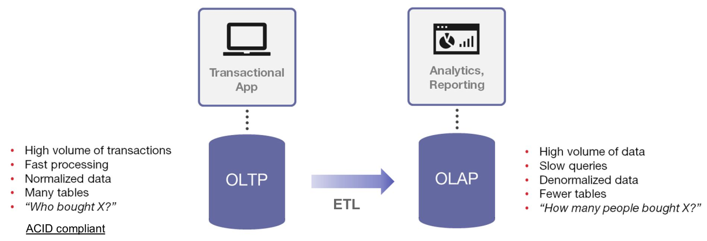
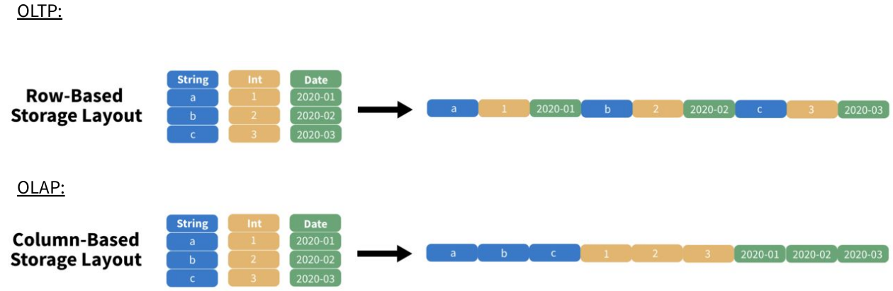
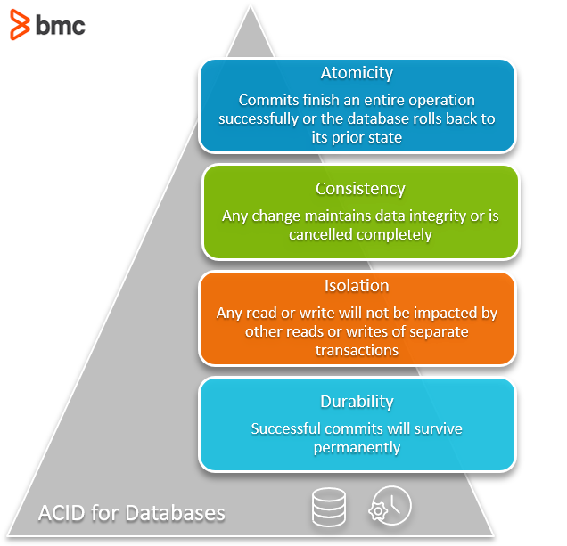

# SQL analytics

Operational applications record events one at a time: an order is placed, a user updates their address, a payment is
accepted. Analytics asks different questions over the same data: how many croissants were sold last month, which
customers buy the most, how sales evolve over time. Answering them means scanning and aggregating millions of records,
a workload with its own storage architectures, file formats and query engines.

SQL remains the common language of analytics, whatever the engine: a data warehouse, a distributed engine such as Spark
or Trino, or an embedded engine such as DuckDB.

## Data storage architecture

Three architectures are used to store the data of an organization for analytics.

- **Data warehouse**  
  A centralized database dedicated to analytics. Data is cleaned, integrated and structured before being loaded
  (schema-on-write). It offers fast SQL queries, transactions and fine-grained access control, but storage and compute
  are proprietary, expensive, and poorly suited to unstructured data. Examples: Teradata, Oracle Exadata, and the cloud
  data warehouses Snowflake, BigQuery and Redshift.
- **Data lake**  
  A large repository storing raw data of any type in its original format: CSV, JSON, logs, images, Parquet files.
  Historically HDFS, today object storage. Storage is cheap and scalable, and the structure is applied when the data is
  read (schema-on-read). Without transactions, schema enforcement and governance, a data lake easily turns into a "data
  swamp" where nobody knows which files are valid.
- **Data lakehouse**  
  Combines both: the data stays in open file formats on object storage, while an open table format (Apache Iceberg,
  Delta Lake, Apache Hudi) and a catalog add the features of a warehouse: ACID transactions, schema evolution, time
  travel. Multiple engines (Spark, Trino, DuckDB) query the same tables.

| Characteristic | Data warehouse          | Data lake                   | Data lakehouse                   |
| -------------- | ----------------------- | --------------------------- | -------------------------------- |
| Data           | Structured              | Any type, raw               | Any type, structured tables      |
| Schema         | On write                | On read                     | On write, with evolution         |
| Storage        | Proprietary             | Open formats, object store  | Open formats, object store       |
| Transactions   | Yes                     | No                          | Yes, through the table format    |
| Cost           | High                    | Low                         | Low                              |
| Main users     | Business analysts, BI   | Data engineers, scientists  | All                              |

The lakehouse is covered in depth in the lakehouse modules. This module focuses on the concepts they share: analytical
workloads, columnar storage and SQL.

## Databases

A database is a collection of tables. In an organization, data comes from multiple sources: web and mobile
applications, connected devices, partners, purchased datasets. Each application usually owns its database, designed for
its own needs.


The goal is to analyze the data they contain. **Can we do it directly in the database?** Running heavy analytical
queries on the database of an application slows it down for its users, and each database only holds a fraction of the
information. To answer this question, the nature of the workloads must be understood.

### OLTP vs. OLAP



[Reference](https://diffzi.com/oltp-vs-olap/)

- **OLTP** (Online Transaction Processing)  
  The workload of operational applications. A high number of short transactions read or modify a few rows, identified
  by their key: create an order, update a stock. Response times are in milliseconds and consistency is critical. Data is
  normalized into many tables to avoid redundancy and update anomalies. Examples: PostgreSQL, MySQL, Oracle Database.
- **OLAP** (Online Analytical Processing)  
  The workload of analytics and reporting. Fewer queries, submitted by analysts, dashboards and pipelines, read millions
  of rows but only a few columns, and aggregate them: sums, averages, counts per group. Data is mostly appended and
  rarely updated. It is often denormalized into fewer, wider tables to avoid costly joins. Examples: Snowflake,
  BigQuery, ClickHouse, DuckDB.

| Characteristic  | OLTP                               | OLAP                                     |
| --------------- | ---------------------------------- | ---------------------------------------- |
| Typical query   | Who bought product X?              | How many people bought product X?        |
| Rows per query  | A few, accessed by key             | Millions, scanned                        |
| Operations      | Insert, update, delete             | Read and aggregate, bulk load            |
| Data model      | Normalized                         | Denormalized                             |
| Data volume     | Current state, gigabytes           | History, terabytes to petabytes          |
| Latency         | Milliseconds                       | Seconds to minutes                       |
| Storage layout  | Row-oriented                       | Column-oriented                          |

An ETL process moves the data from the OLTP systems into the OLAP system.

### Row-oriented vs. columnar storage



A table is two-dimensional, but disks and memory are one-dimensional: the values must be serialized in some order.

A **row-oriented** layout stores all the values of a row next to each other. Reading or writing a complete record is a
single operation, which suits OLTP: inserting an order, or fetching a user by its identifier through an index. A query
computing the total quantity sold must however read every row entirely, including the columns it does not need.

A **column-oriented** layout stores all the values of a column next to each other. It benefits analytical queries:

- **Column pruning**  
  Only the columns referenced by the query are read. A query using 2 columns of a 100 columns table reads about 2% of
  the data.
- **Compression**  
  Values of the same column share the same type and often similar values. Encodings such as dictionary (replace
  repeated strings with small integers), run-length (store a value and its number of repetitions) and delta (store the
  difference between consecutive values) reduce the size by a factor of 3 to 10, and less data means less I/O.
- **Vectorized execution**  
  The engine processes batches of values of a single column in tight loops, which uses CPU caches and SIMD
  instructions efficiently, instead of interpreting the query row by row.
- **Statistics**  
  Minimum and maximum values stored per block let the engine skip the blocks which cannot match a filter.

In return, inserting or updating a single row touches every column, which is slow. Columnar systems favor bulk loads and
rarely update data in place.

### ACID properties



[Reference](https://www.bmc.com/blogs/acid-atomic-consistent-isolated-durable/)

A transaction groups several operations into a single logical unit of work. Transactional databases guarantee 4
properties:

- **Atomicity**: all the operations of a transaction succeed, or none of them is applied. A transfer never debits an
  account without crediting the other.
- **Consistency**: a transaction moves the database from a valid state to another valid state, respecting its
  constraints (primary keys, foreign keys, checks).
- **Isolation**: concurrent transactions do not see each other's intermediate states. The result is the same as if they
  were executed one after the other, depending on the isolation level.
- **Durability**: once committed, a transaction survives crashes, usually thanks to a write-ahead log.

ACID guarantees are mandatory for OLTP. They also matter for analytics: a dashboard must not read a table while a job is
half-way through rewriting it. Traditional data warehouses provide them, plain files on a data lake do not, which is the
main problem solved by open table formats in the lakehouse.

### Analytics at the enterprise scale

- Many departments collect or buy data
- Management would like to get insights from these data as a whole
- But:
  - The data might be (or, probably is) messy
  - Different bits of information can be found in different tables and systems
  - The same notion has different names, formats and identifiers across departments
- Does every department manage the collection, cleaning and maintenance by themselves?

Letting each department build its own reports leads to duplicated efforts and to contradicting figures in management
meetings. The answer is a single, integrated repository dedicated to analytics: the data warehouse.

## Data warehouse


Operational systems and external sources feed the data warehouse through ETL tools, which clean, transform and integrate
the data. Data marts expose subsets of the warehouse dedicated to a department or a subject. Reporting, analysis and
data mining tools query the warehouse and the data marts. Metadata describes the content, the origin and the meaning of
the data.

Data warehouse characteristics:

- **Subject-oriented**:
  - compiles subject-related data (e.g. sales, marketing, distribution...)
  - prepares data for decision-making
  - excludes irrelevant data
- **Integrated**:
  - integrates data from different sources
  - imposes rules to make data consistent (naming conventions, unifying date formats...)
- **Time-variant**:
  - each record contains a notion of date
  - long-term data collection
  - when data is inserted into warehouse, it cannot be changed
- **Non-volatile**:
  - data is read-only
  - new data is appended, previous data is not erased

[Reference](https://www.guru99.com/data-warehouse-architecture.html)

### Dimensional modeling

Data warehouses commonly organize data with the dimensional model popularized by Ralph Kimball.

- **Fact tables** record measurable business events: an order, a payment, a page view. They contain numeric measures
  (quantity, amount) and foreign keys to the dimensions. They are long, with one row per event.
- **Dimension tables** describe the context of the facts: who, what, where, when. For example a user, a product, a store
  or a calendar date. They are wide, with many descriptive attributes, and short.

In a **star schema**, the fact table sits in the center and references denormalized dimension tables. A **snowflake
schema** normalizes the dimensions into sub-dimensions, saving space at the cost of additional joins.

The datasets of the labs follow this model: `orders` is a fact table with a `quantity` measure, linked to the `users`
dimension through `user_uuid`. The `product` and `date` columns are degenerate dimensions, stored directly in the fact
table.

Dimensions change over time: a user moves to another city. Slowly changing dimensions (SCD) define how to keep the
history, for example by overwriting the value (type 1) or by adding a new row with validity dates (type 2).

## SQL for analytics

Analytical SQL goes beyond selecting rows. The following constructs are supported by most engines.

Aggregations summarize groups of rows:

```sql
SELECT product, count(*) AS orders, sum(quantity) AS quantity
FROM orders
GROUP BY product
ORDER BY quantity DESC;
```

Joins combine facts and dimensions:

```sql
SELECT u.name, sum(o.quantity) AS quantity
FROM orders o
JOIN users u ON o.user_uuid = u.uuid
GROUP BY u.name;
```

Common table expressions (CTE), with the `WITH` clause, split a complex query into named, readable steps:

```sql
WITH monthly AS (
  SELECT date_trunc('month', date) AS month, sum(quantity) AS quantity
  FROM orders
  GROUP BY month
)
SELECT avg(quantity) FROM monthly;
```

Window functions compute a value for each row over a set of related rows, without collapsing them like `GROUP BY` does.
They are used for rankings, running totals, moving averages, and comparisons with the previous period:

```sql
SELECT
  date,
  quantity,
  sum(quantity) OVER (ORDER BY date) AS cumulative_quantity,
  rank() OVER (PARTITION BY product ORDER BY quantity DESC) AS rank_in_product
FROM orders;
```

Other common constructs include `CASE WHEN` expressions, `GROUPING SETS`, `ROLLUP` and `CUBE` to compute several levels
of aggregation in a single query, and `PIVOT` to turn rows into columns.

## Analytical query engines

Several families of engines execute analytical SQL:

- **Cloud data warehouses** (Snowflake, BigQuery, Redshift): managed services, storage and compute are provided and
  billed by the vendor.
- **Distributed SQL engines** (Trino, Spark SQL, Apache Impala): query files on a data lake or a lakehouse, the query
  is split into tasks executed in parallel on a cluster of workers. They scale to petabytes and are covered in the next
  modules.
- **Real-time OLAP databases** (ClickHouse, Apache Druid, Apache Pinot): ingest streams and serve low-latency queries
  for user-facing dashboards.
- **Embedded engines** (DuckDB, chDB, Polars): run inside the process of the application on a single machine, without
  any server.

A distributed engine pays a cost for coordination: planning, scheduling tasks, transferring data between nodes over the
network. Below a few hundred gigabytes, a single modern machine with tens of cores and hundreds of gigabytes of memory
is often faster and much simpler to operate.

Whatever the engine, the same techniques make analytical queries on object storage efficient:

- **Projection pushdown**: only the required columns are read from the files.
- **Predicate pushdown**: filters are evaluated while reading, using file statistics to skip data.
- **Partition pruning**: files stored in directories named after a column value, such as `product=cookie/`, are
  skipped when the filter excludes them.

These techniques depend on the file format.

## Columnar file formats

CSV and JSON files are row-oriented text formats. They are human-readable and universally supported, but an engine must
read and parse every byte, the types must be inferred, and the compression is poor.

[Apache Parquet](https://parquet.apache.org/) is the reference columnar file format of the big data ecosystem. A Parquet
file is organized as:

- **Row groups**: horizontal partitions of the rows, typically 100 MB to 1 GB each. They are the unit of parallelism.
- **Column chunks**: inside a row group, the values of each column are stored together.
- **Pages**: column chunks are split into pages, the unit of encoding and compression.
- **Footer**: at the end of the file, the schema, the location of every column chunk, and statistics such as the
  minimum, maximum and number of nulls of each column chunk.

An engine first reads the footer, then fetches only the column chunks of the required columns, and skips the row groups
whose statistics do not match the filter. On object storage, these are HTTP range requests: a query may read a few
megabytes of a multi-gigabyte file.

Parquet files are typed, compressed (Snappy, Zstandard, Gzip) and immutable. Other formats include Apache ORC, similar
to Parquet and historically associated with Hive, and Apache Arrow, a columnar format designed for data in memory and
for exchanging data between processes without serialization. Avro is a row-oriented binary format, used for streaming
and for data exchange rather than analytics.

Open table formats such as Apache Iceberg store table data as Parquet files and add a metadata layer on top of them.

## DuckDB

[DuckDB](https://duckdb.org/) is an open-source, in-process analytical database. It is often described as "the SQLite
for analytics": like SQLite, it has no server to install or operate, it runs inside the host process and it stores a
database in a single file. Unlike SQLite, which is row-oriented and designed for OLTP, DuckDB is built for OLAP.

DuckDB is developed by DuckDB Labs, a spin-off of the CWI research institute in Amsterdam, and released under the MIT
license. The DuckDB Foundation owns the intellectual property of the project to guarantee it stays open source.

### Architecture

- **In-process**  
  DuckDB is a library linked into the application: the CLI, a Python script, a Java application, a web browser with
  WebAssembly. There is no network protocol between the application and the database, and results are transferred to
  the application without copies, for example as Arrow tables or Pandas and Polars dataframes.
- **Columnar and vectorized**  
  Data is stored and processed column by column, in vectors of 2048 values.
- **Parallel**  
  Queries use all the cores of the machine.
- **Larger than memory**  
  Operators such as joins, aggregations and sorts spill to disk when the data does not fit in memory.
- **Transactional**  
  DuckDB supports ACID transactions with multi-version concurrency control (MVCC). A database file is opened by a
  single process in read-write mode, or by several processes in read-only mode.
- **Extensible**  
  Features are provided by extensions, downloaded and loaded automatically on first use: `httpfs` for HTTP and S3,
  `aws` for AWS credentials, `postgres` and `mysql` to query operational databases, `iceberg`, `delta` and `ducklake`
  for table formats, `spatial` for geospatial data.

### Querying files directly

DuckDB queries CSV, JSON and Parquet files without loading them first. The files can be local, or remote on HTTP
servers and on object storage. The schema of CSV and JSON files is detected automatically by sampling the data:

```sql
-- Local CSV file, the reader function is inferred from the extension
SELECT count(*) FROM 'orders.csv';
-- Multiple Parquet files on S3 using a glob pattern
SELECT product, sum(quantity)
FROM read_parquet('s3://my-bucket/orders/*.parquet')
GROUP BY product;
```

Access to object storage is configured with secrets, which hold the credentials, the endpoint and the region of an S3
compatible service:

```sql
CREATE SECRET my_s3 (
  TYPE s3,
  PROVIDER credential_chain,
  ENDPOINT 's3.example.com',
  URL_STYLE 'path'
);
```

DuckDB also writes files, locally or to object storage, with the `COPY` statement, including Hive-partitioned datasets:

```sql
COPY orders TO 's3://my-bucket/orders' (FORMAT parquet, PARTITION_BY (product));
```

### Friendly SQL

DuckDB follows the PostgreSQL dialect and adds extensions which simplify interactive analysis:

- `FROM` first: `FROM orders` is a valid query, equivalent to `SELECT * FROM orders`
- `GROUP BY ALL` and `ORDER BY ALL` group or order by all non-aggregated columns
- `SELECT * EXCLUDE (column)` and `SELECT * REPLACE (expression AS column)`
- `DESCRIBE` and `SUMMARIZE` display the schema and statistics of a table, a query or a file
- `QUALIFY` filters the result of window functions
- `PIVOT` and `UNPIVOT`

### Use cases and limitations

DuckDB fits:

- interactive exploration of datasets, on a laptop or in a notebook
- data transformation pipelines on a single node, for example with dbt, used in the next module
- processing datasets up to hundreds of gigabytes, often faster than a cluster
- embedded analytics inside applications, including in the browser

DuckDB is not suited for:

- OLTP workloads with many small concurrent writes
- concurrent writes from multiple processes to the same database file
- a shared, multi-user database server: each process runs its own engine
- datasets which exceed the capacity of a single machine, which require a distributed engine such as Spark or Trino

In a data platform, DuckDB complements distributed engines rather than replacing them: the same Parquet files and
Iceberg tables stored on object storage can be processed by Spark, served to analysts by Trino, and explored by a data
scientist with DuckDB.

## References

- [Data warehouse vs. data lake vs. data lakehouse](https://www.databricks.com/glossary/data-lakehouse)
- [OLTP vs. OLAP](https://aws.amazon.com/compare/the-difference-between-olap-and-oltp/)
- [Apache Parquet documentation](https://parquet.apache.org/docs/)
- [DuckDB documentation](https://duckdb.org/docs/)
- [DuckDB: an embeddable analytical database](https://mytherin.github.io/papers/2019-duckdbdemo.pdf)
- [Kimball books](https://www.kimballgroup.com/data-warehouse-business-intelligence-resources/books/)

---

_The content of this document, including all text, images, and associated materials, is the exclusive property of
Adaltas and is protected by applicable copyright laws. Unauthorized distribution, reproduction, or sharing of this
content, in whole or in part, is strictly prohibited without the express written consent of the author(s). Any violation
of this restriction may result in legal action and the imposition of penalties as prescribed by law._
